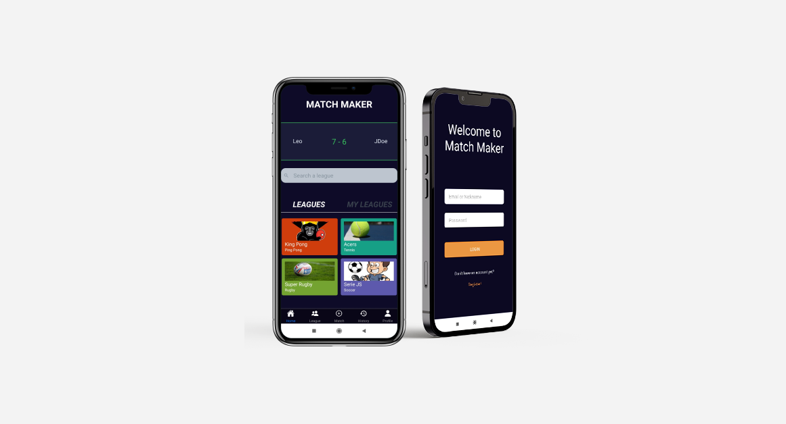

# Welcome to the Match Maker!

Team work project made from scratch with other 4 developers 

## Mobile App created with React Native

## Features:

   - Register, Login, Logout and user session persistance with JWT auth.
   - Edit user info and picture with Firebase storage
   - Create a public or private League with secret key for joining.
   - Search a public or private league, join a league and start with default elo (for users ranking)
   - Create a 2 teams match with users from a league you belong and select exact date, hour and invitation message
   - Result confirmation only when one of each team confirms result
   - ELO and ranking automatically update at result confirmation

## Client: 

React Native + Redux

## Backend: 

nodeJS, Express and MongoDB
